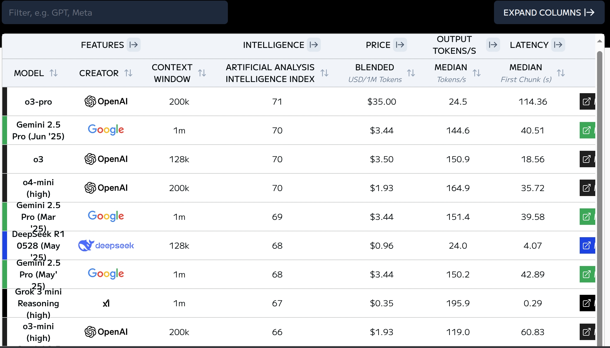
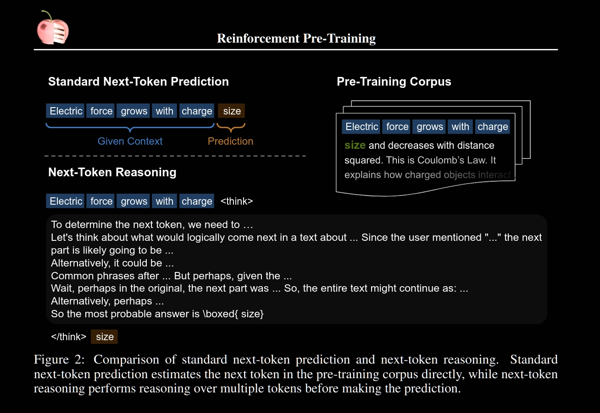
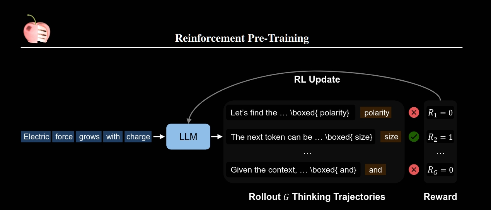
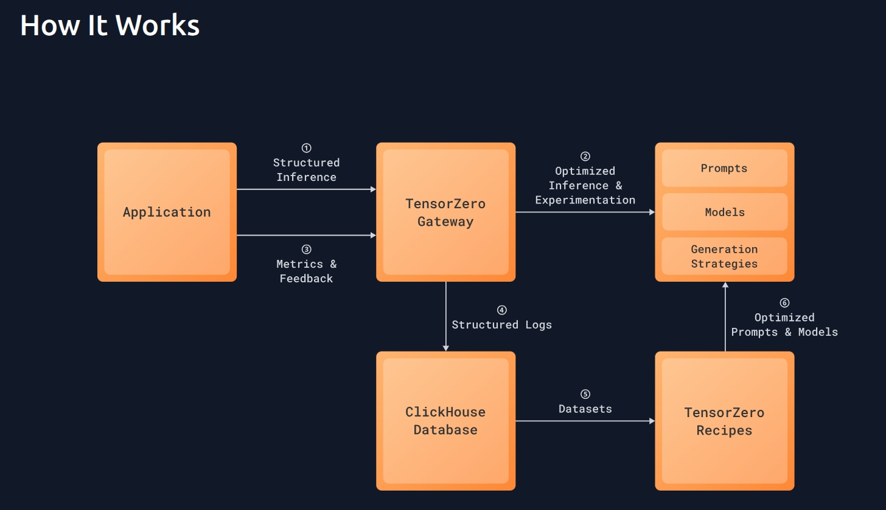
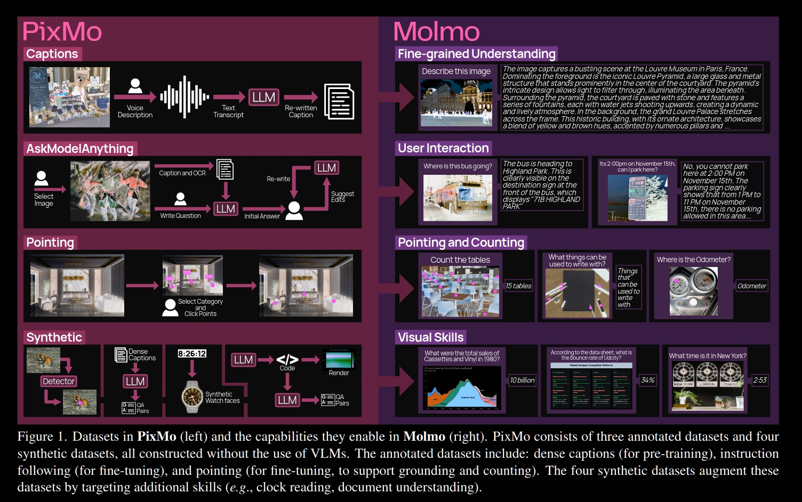
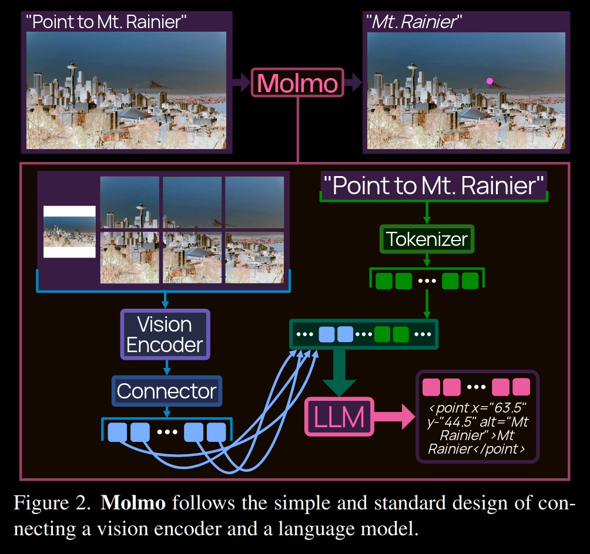
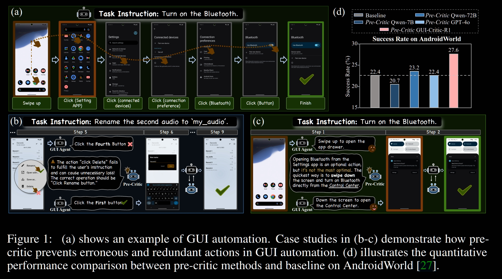
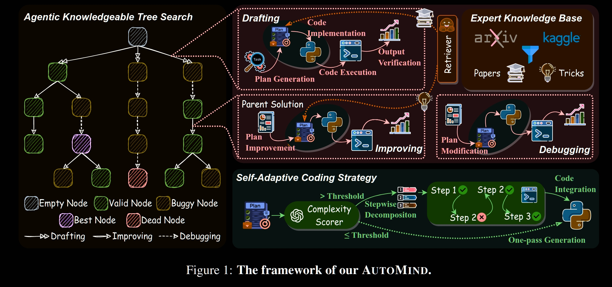

**欢迎来看Tom看到的《一周科技大事》**
>- 这里会每周传递我看到的 AI 领域的产品与技术进展，产品方面会关注到 AI，低空经济，人形机器人，技术主要聚焦于 Agent，大模型
>- 简单说明一下专栏的内容。这个专栏会有相对细节的技术解读，也会有相对简单的产品和事件报道，技术方面可以看对我聚焦的方向是否感兴趣再深入
>- 欢迎评论发表看法

# Buzz
> 在Buzz专栏会每周追踪大模型的最新排名，HuggingFace的最热paper解读，github的最热repo解读。Stay informed. Stay ahead.

### 通用语言大模型排名

  

<em>Artificialanalysis.AI Ranking</em>

本周 OpenAI 的 o3-pro 胜出，领先一个点

### HuggingFace 一周最热 Paper 解读
> 论文地址：https://arxiv.org/pdf/2506.08007

**主题**：Reinforcement Pre-Training

**解读**：
- 背景：过去大模型的训练先后出现两个缩放定律，第一个是预训练阶段缩放，即数据越多参数越大效果越好；第二个是测试阶段缩放，即推理时间越长路径越多效果越好
- 本工作成果：introduce Reinforcement Pre-Training (RPT) as a new scaling paradigm for large language models and reinforcement learning (RL).
- 核心创新方法：
  

    
  

  
<em>RPT 的方法（对比传统预测下一词）</em>

  

    
  

  
<em>RPT 奖励信号构造，就是通过 Reasoning 后预测对则给1错则给0</em>

  但注意，这里的预测并不是直接token粒度的匹配，假设 ground-truth 是 extraordinary，模型预测是 extr, extra, 或 extrao（即它“快猜对了”），用 token-level 匹配，只有完整猜对 extraordinary 才能拿到奖励；否则都是 0 分。而本文在这里提出了字节粒度的匹配，只要模型输出的字节序列是 ground-truth 字节序列的一个前缀，并且刚好截断在 token 边界，就给 1 分。
- 训练策略：
  - 数据集选用OmniMATH，主要是数学题；对训练集做预处理，选出值得Reasoning预测的token, 因为很多简单的不需要 reasoning 就能猜对，筛选方法是看预测 entropy，只保留难预测的。
  - 模型选用 Deepseek-R1-Distill-Qwen-14B，是一个具备基本推理能力的大模型，适合做强化预训练起点
  - 强化学习算法用 GRPO
- 评估方式：
  - Language Modeling（语言建模）：看预测准确率
  - Reinforcement Fine-Tuning on Downstream Tasks（强化微调）：看那RPT后的模型做下游任务指标是否提升

**我的看法**：我觉得挺好的，实现起来简单，是一个很自然有效的训练算法

### Github 一周最热 Repo 解读
> Repo地址：https://github.com/tensorzero/tensorzero

**项目名称**: Tensorzero

**解读**: 
- 在干什么：Tensorzero 是一个用于动态优化 基于大模型做的应用 的反馈循环系统。整体目标是通过生产环境中的实际使用数据，不断让模型变得更聪明、更快、更便宜。
- 架构组成和核心功能：
  1. 一个用 Rust 写的高性能网关，提供一个统一API对接主流LLM服务商
  2. 反馈机制，自动记录推理过程中产生的各种 metrics 和用户反馈
  3. 优化循环，使用反馈数据来优化模型和提示词（prompts）、推理策略（例如使用不同温度、多轮对话结构等）。提供可复用的工作流模板（recipes），自动化进行模型微调、prompt 优化等，也可以自定义。
  4. 实验功能，内建 A/B 测试、流量分流（routing）、fallback 支持
- 工作流：
  

    
  

  
<em>Tensorzero工作流</em>

**我的看法**：
我会想基于它的架构来搭建LLM应用试试，因为过去我Prompt调优也确实是手动的（有用过Self-Refine但没特地模块化），且写每个API厂商的接口也确实麻烦

# 产品速报
> 每周精选最新 AI 产品动态，聚焦工具、平台与市场趋势。
- Apple 在 WWDC 上推出 Liquid Glass，这种新材质是半透明的，其表现类似于现实世界中的玻璃。它的颜色由周围的内容决定，并智能地适应明暗环境。创造了一种更生动的体验。[官网公告](https://www.apple.com/newsroom/2025/06/apple-introduces-a-delightful-and-elegant-new-software-design/)
- Microsoft 推出了两款新设备——ROG Xbox Ally 和 ROG Xbox Ally X。这是 Microsoft 推出的 Xbox 掌上游戏机

# 事件速报
> 每周精选最新科技行业事件。
- Meta 最近签署了一项近 $15B 的交易，**收购**了 Scale AI 49% 的股份——在 Llama 4 发布后，28 岁的首席执行官 Alexandr Wang 将领导Meta 的 AI 重启。
- 特朗普消除对电动空中出租车、城市无人机运营和超音速商用飞机的监管壁垒。**利好低空经济**
- OpenAI 公布ARR已经达到10B美元。如果按30倍收入倍数法计算，现OpenAI的估值已经达到3000亿美元（2万亿人民币，腾讯4万亿）[CNBC报道](https://www.cnbc.com/2025/06/09/openai-hits-10-billion-in-annualized-revenue-fueled-by-chatgpt-growth.html?utm_source=tech.therundown.ai&utm_medium=referral&utm_campaign=apple-jumps-into-liquid-glass)
- Anysphere，Cursor的母公司，估值达到10B美元，也即700亿人民币左右。[TechCrunch报道](https://techcrunch.com/2025/06/05/cursors-anysphere-nabs-9-9b-valuation-soars-past-500m-arr/)

# 技术速报
> 每周追踪核心技术进展，涵盖模型发布、开源工具与研究亮点。
### 2025CVPR最佳论文提名的SOTA开源VLM（性能现已过时）
> 论文：[Molmo and PixMo: Open Weights and Open Data for State-of-the-Art Vision-Language Models](https://arxiv.org/abs/2409.17146) 
> 本文获得2025CVPR最佳论文提名，但到现在实际上效果已经不行了，看现在OpenCompass都没这个模型的影子，就看看最佳论文提名做的怎么样

**本文成果**: 团队贡献了 Molmo，一个新的VLM系列，它们是开源且当下SOTA的。另一方面贡献了PixMO的新数据集的集合，包括用于预训练的highly detailed image captions 数据集，用于微调的 free-form image Q&A 数据集以及创新的 2D pointing 数据集，所有这些数据集都在不使用外部VLM的情况下收集。

**方法**: 

  

<em>训练数据任务形式及其使能的模型能力，以及数据制作方式</em>

  

<em>模型架构</em>

- Vision Encoder: 比较常规，试了CLIP, SigLIP等
- Cropping: 也比较常规，切块+整图输入，重叠Crop（重叠提升显著）
- Vision-Language Connector: 将倒数第3层和倒数10层的特征拼接以丰富表示；2x2 attention pooling 后 MLP 映射
- LLM: Qwen2 72B等；最佳配置是：ViT-L/14 + Qwen2 72B
- Vision Token 序列设计：Patch 顺序：左到右、上到下，先是低分辨率整图，再是高分辨率 crop。插入特殊标记 token 表示 row 分割、开始与结束。这样排列可帮助 LLM 理解空间结构。
- Multi-Annotated Images: 多个标注（如 VQA 多个QA对）被拼接为一个长文本序列。Attention Mask 限制每个注释token只能关注自己的图像和注释，不干扰其他注释。显著提升训练效率（减少2/3图像处理量，训练时间缩短一半，序列长度仅增加25%）

**训练策略**:
- 预训练：在 PixMo-Cap 上训练，直接端到端训练，仅对 connector 使用 更高学习率 + 更短 warmup
- 微调：混合 PixMo 数据集与多种开源数据集

**我的看法**:
- 除了Overlap似乎是当时VLM都没搞的，本论文在方法创新上感觉没多少特别之处..

### GUI Agent降低误操作设计
> 论文：[Look Before You Leap: A GUI-Critic-R1 Model for
Pre-Operative Error Diagnosis in GUI Automation](https://arxiv.org/pdf/2506.04614) 
> 一句话：本文提出了一个 “预操作批判模型（pre-operative critic）” ——GUI-Critic-R1，用于在执行之前对多模态大模型的动作进行智能评估，增强 GUI 自动化任务中的安全性和准确性。

**背景**：GUI-based 的 Agent 交互的是线上实时环境，误删、误付费一发生则难以回撤

**解决方案**：Pre-operative Critic机制，即在真正执行前，先让模型评估当前决策是否合理。采用S-GRPO 策略，其实就是一个 RL-based 的训练方法，得到一个GUI-Critic-R1 模型，后续就是这个模型来进行执行前预评估。

  

<em>工作流展示

**我的看法**: 感觉挺水一篇... 不觉得是这个方向的最终成熟方案

### 适应性强的数据科学Agent框架
> 论文：[AUTOMIND: Adaptive Knowledgeable Agent for Automated Data Science](https://huggingface.co/papers/2506.10974) 
> AutoMind 是一个智能、可自适应的 LLM agent 框架，面向复杂数据科学任务

**背景**：现在的数据科学Agent依赖固定工作流和死板代码策略

**创新做法**：
- 专家知识库支持（Expert Knowledge Base）：引入结构化的专家知识作为外部知识库，增强 agent 的专业性和上下文理解能力。
- 智能搜索机制（Knowledgeable Tree Search）：采用类似启发式树搜索的机制，模拟 agentic-style 的多路径探索；用策略性搜索代替静态执行，逐步发现更优解。
- 自适应代码生成（Self-Adaptive Coding Strategy）：据任务复杂度动态调整代码生成方式；比如对简单任务直接生成代码，对复杂任务逐步拆解并规划。

  

<em>Automind的Framework</em>

**我的看法**：感觉很常规的应用算法设计...

# 最后
本周的专栏文章给你带来了什么吗？欢迎留言～

